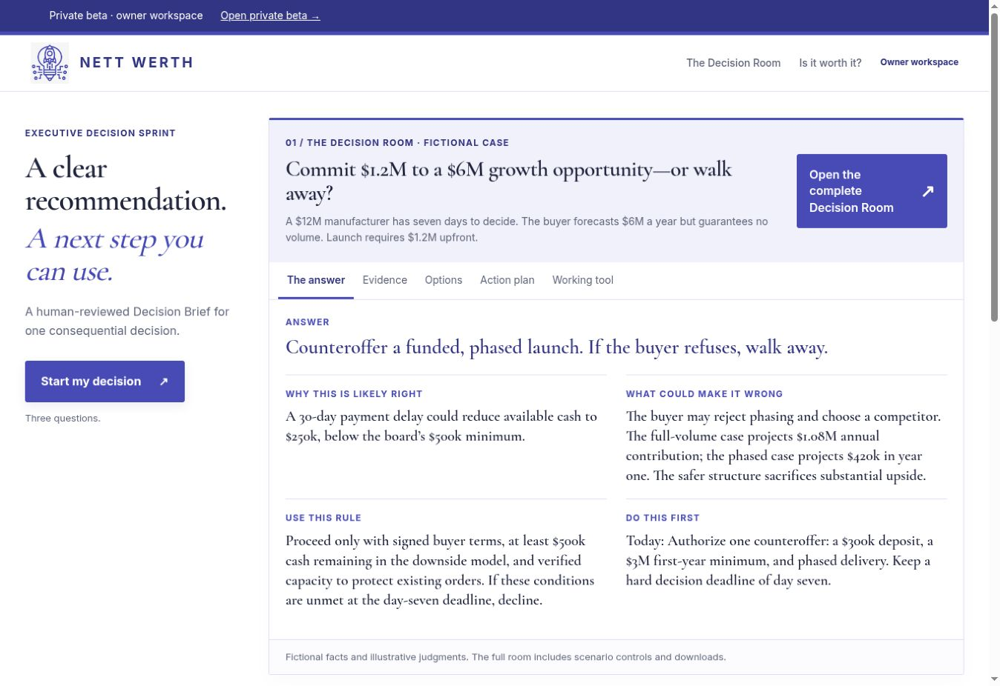

# Executive Decision Sprint

**A human-reviewed Decision Brief for one consequential decision.**

An AI-assisted decision-support product by **Benjamin Bowles, Founder & Managing Director of Nett Werth LLC**.

A consequential decision rarely arrives with complete evidence, agreement, or control over the outcome. EDS helps a decision owner frame the choice, examine the evidence, compare viable options, and decide what to do next—and what would justify changing course.

**Status: working private beta · updated September 28, 2026.** Live AI generation and two authorized email-and-workflow test journeys have passed. Customer validation and readiness for a public, paid launch remain open.

*Actual private-beta interface, captured September 28. The manufacturing case shown is fictional; it is not a customer engagement or a business result.*

## From a difficult choice to a usable Decision Room

| Step | What happens |
| --- | --- |
| Frame the decision | A short starting intake identifies the choice, deadline, and difficulty. Guided evidence collection then develops the Decision Record. |
| Prepare the analysis | AI organizes the supplied material and drafts a recommendation, alternatives, assumptions, and objections. |
| Review and challenge | The owner examines the exact customer preview, corrects the draft, asks for clarification, or requests further evaluation. |
| Approve and deliver | The reviewed version is released to a private Decision Room, with customer and owner email notifications. |
| Learn from the outcome | The recipient records feedback, intended adoption, and a later outcome. |

The delivered room brings together a short answer, its supporting evidence, the strongest case against it, a cost comparison, conditions for proceeding, a 30-day action path, and a decision-specific working tool. Interactive scenario controls help expose what a changed assumption would do to the option ranking; they do not establish that an assumption is true.

## What has been demonstrated

On September 28, the deployed private beta completed two fictional owner-operations test journeys through analysis, review and editing, approval, email delivery, customer-room display, feedback, and outcome recording.

- Six transactional notifications were confirmed delivered across the two journeys.
- The landing page's main call to action opened its three-question starting intake.
- The public beta and portable student kit were preserved.
- Software-test records remained excluded from the customer-validation count.

These checks establish that the exercised workflows worked. They do **not** establish customer demand, better business decisions, guaranteed savings, or readiness for unrestricted production use.

[Read the verification scope and remaining work](docs/beta-verification.md).

## The review is part of the product

In the latest software tests, generated drafts included timing and currency assumptions that needed correction. Review separated an authorization deadline from the later completion of a two-week pilot and removed unsupported currency conversions before release.

That is a concrete reason to keep an accountable review step. A polished recommendation still needs someone to check what is true, what is assumed, what is missing, and what the decision owner can actually authorize.

| AI assistance | Human responsibility in the intended service |
| --- | --- |
| Organize supplied evidence and draft comparisons. | Define the decision, priorities, authority, and boundaries. |
| Suggest alternatives, objections, and questions. | Check material claims and challenge the reasoning. |
| Prepare a draft and supporting tools. | Revise or reject it, approve release, and retain accountability for the decision. |

## My role

I lead product direction, decision framing, workflow requirements, customer experience, and the standards used to review recommendations. My background spans public-sector technology, commercial strategy, and operational governance in the United States and Singapore.

AI-assisted development supports implementation and testing. This project demonstrates my work in designing and governing a decision-support service; it does not imply that I hand-coded every component or that AI-generated analysis is independently verified.

## Architecture and student collaboration

The private application uses React, Vite/Vinext, a Cloudflare Worker and D1, with OpenAI for optional analysis and Resend for transactional delivery. Sites currently hosts the private review deployment.

A portable AI4VA practice kit has been prepared with fictional cases, local setup instructions, tests, and instructor guidance. It is intended to let students examine intake, workflow, and evidence quality in a separate development environment.

This public repository contains the product walkthrough and sanitized documentation. Application source, production configuration, private Decision Rooms, customer records, and credentials are not published here.

[Read the architecture and collaboration boundaries](docs/architecture-and-collaboration.md).

## Explore and follow the work

- [Earlier public beta](https://nettwerth-beta-next.benjamin-bowles88.chatgpt.site/) — preserved separately; it is not the latest private review deployment.
- [September 16 portfolio walkthrough](docs/archive/portfolio-2026-09-16.md) — the original fictional worked example, retained for continuity.
- [LinkedIn — Benjamin Bowles](https://www.linkedin.com/in/benjamintbowles)

The next evidence to collect is whether real decision owners find the intake manageable, understand the tradeoffs, trust the evidence distinctions, and can use the resulting next steps. The private beta is ready for owner review; payments remain disabled.
